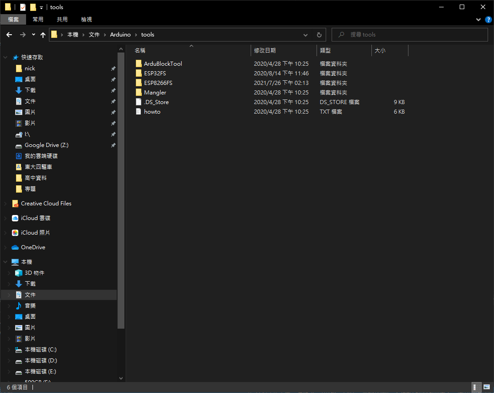
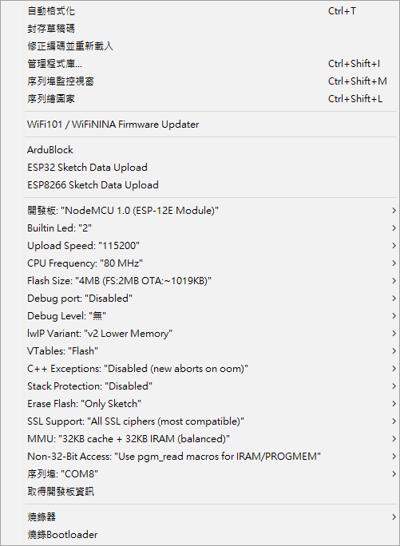
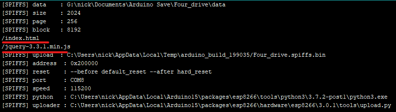

# ESP FS檔案系統

## 讓ESP Arduino-ide能夠使用而外檔案

從GitHub下載
[ESP8266FS](https://github.com/esp8266/arduino-esp8266fs-plugin/tags)
[ESP32FS](https://github.com/me-no-dev/arduino-esp32fs-plugin/tags)
檔案燒錄工具

## 解壓縮燒錄工具

將燒錄工具解壓縮到 Arduino/tools/資料夾裡

## 使用Arduino

重新開啟Arduino 檢查工具是否有出現 ESP32/ESP8266 Sketch Data Upload

### 上傳測試

點擊ESP32/ESP8266 Sketch Data Upload
  
確認是否你要的檔案

  
確認是否有成功

## 0.0.1

更新:步進馬達控制方式由角度控制改為方向控制、網頁步進馬達按鈕改變  
新增:煞車控制防止斜坡下滑、網頁新增P檔煞車按鈕  
加回:超音波距離小於40cm停止程序  
增強:馬達控制方式要改進可能需要使用ESP32雙核心減少運行馬達加速的時間  
增強:超音波不穩定nano測試一樣會數值不實際  
增強:可以在網頁顯示現在是否P檔

## 已知問題

不能在序列埠監控視窗開啟時燒錄
